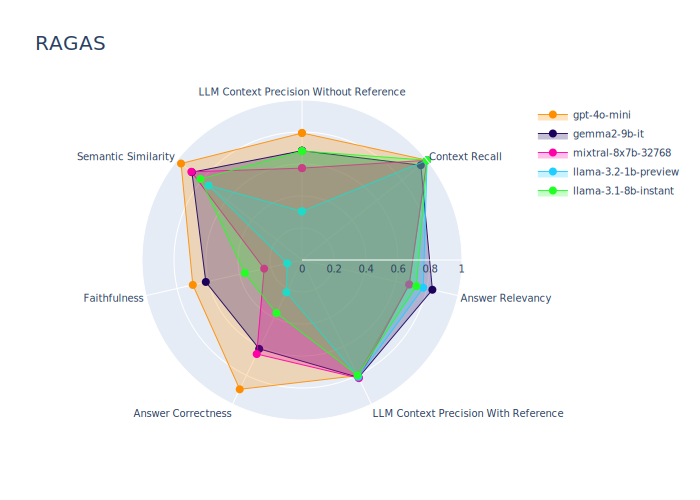

# MIES-RAG 

The chart below presents the benchmark results of various LLM models, evaluated using the [Ragas](https://github.com/explodinggradients/ragas) library. The analysis assesses the quality of generated responses encoded according to key metrics.  



# Program Setup Instructions

## Prerequisites
Before running the program, make sure you have the following software installed:
- Python (recommended version 3.12)
- Pip (Python Package Installer)

## Installation

1. Install the required libraries by running the following command in the terminal:
    ```bash
    pip install -r requirements.txt
    ```

## Preparation

1. **Add Articles for Analysis**  
   Place the article files to be processed in the `input` folder. 

2. **Provide Questions**  
   Open the `/config/query.py` file and fill in the array with the questions to be asked based on the articles.

3. **Check Configuration Settings**  
   In the `/config/config.py` file, you can customize various program parameters.
   - `API`
      - Choose openai/groq.
      - Api must match the model.
   - `MODEL`
      - Choose model
   - `MAX_STEPS = 3`
      - The maximum number of iterations (question+subquestions)
      - subquestion if they are enabled they start when max_step is at least = 1
   - `DESABLE_SECOND_LOOP = False`
      - Disable the second loop (subquestions)
   - `EVALUATION = False`
      - Determines whether to execute the evaluation function.
      - Evaluation works only with openai.
      - **Note**: Running this function is resource-intensive and can consume a large number of tokens if using an LLM API.
   - `RAGAS = False`  
      - Activates Ragas for evaluation when EVALUATION is enabled.
   - `G_EVAL = False`  
      - Activates Geval for evaluation when EVALUATION is enabled.
   - `CLEAR_STORAGE = False`
      - Controls whether to clear the program's cache (vector index for each PDF).
      - If set to `False`, the vector index for previously processed PDFs will be loaded from storage for subsequent runs of the program.
      - If set to `True`, the storage will be cleared, forcing the program to recreate the vector index for each PDF from scratch. Use this to test the program's behavior with fresh data.


   - `COHERE_RERANK = False`  
      - If True, utilizes the Cohere reranker to improve the selection of the best context.

   The default settings should work correctly, but you can adjust them as needed.

4. **Add API Keys**  
   In the `/config/config_keys.py` file, add your API keys for the LLM (Large Language Model) tools:
   - `OPENAI_API_KEY` – API key for OpenAI.
   - `LLAMA_PARSE_API_KEY` – API key for LlamaIndex.
   - `GROQ_API_KEY` - API key for Groq.
   
   **Note:**  
   The `COHERE_API_KEY` is currently not used and can be left empty.

## Results and Reports

- **`output/` Folder**  
  For each program run, a new folder is created inside the `output` directory with the current date and time as its name. This folder contains all generated reports, including partial reports and the final main report.

- **`storage/` Folder**  
  The program saves vector indices (vector database) in the `storage` folder. This allows:
  - Skipping the process of rebuilding the vector database during subsequent runs.
  - Faster execution by loading data directly from the stored indices.

## Running the Program

1. To run the program, use the following command:
    ```bash
    python main.py
    ```

The program will analyze the articles, answer the provided questions, and generate results.
